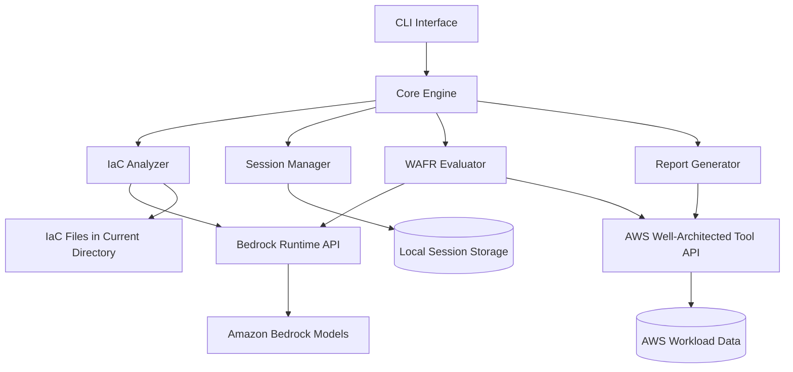

# Design Document

## Overview

Waffle is a CLI-based service that automates AWS Well-Architected Framework Reviews by analyzing infrastructure-as-code in the current directory. The system leverages Amazon Bedrock foundation models (via direct API invocation) to parse IaC files, evaluate them against WAFR questions, identify risks, and generate improvement plans. The design emphasizes portability, automation, CI/CD integration, and adherence to WAFR terminology and best practices.

### Key Design Principles

1. **Automation-First**: Minimize manual intervention in the review process
2. **IaC-Centric**: Focus exclusively on analyzing code rather than deployed infrastructure
3. **WAFR Compliance**: Use official WAFR terminology and structure throughout
4. **CI/CD Ready**: Design for seamless integration into automated pipelines
5. **Extensible**: Support multiple IaC frameworks and WAFR lenses

## Architecture

### High-Level Architecture



### Component Responsibilities

- **CLI Interface**: Command-line entry point, argument parsing, output formatting
- **Core Engine**: Orchestrates the review workflow and coordinates components
- **IaC Analyzer**: Retrieves and parses IaC files, extracts resource configurations
- **Session Manager**: Manages review session lifecycle and persistence
- **WAFR Evaluator**: Evaluates workload against WAFR questions using Bedrock
- **Report Generator**: Creates formatted reports and milestone comparisons
- **Bedrock Client**: Invokes foundation models directly for IaC parsing and WAFR analysis

## Components and Interfaces

### CLI Interface

**Purpose**: Provide command-line access to Waffle functionality

**Commands**:
- `waffle review` - Initiate a new WAFR review (runs in current directory)
- `waffle status <session-id>` - Check review session status
- `waffle results <session-id>` - Retrieve and display review results (uses AWS GetConsolidatedReport API)
- `waffle compare <session-id-1> <session-id-2>` - Compare two milestones
- `waffle init` - Validate AWS setup (credentials, Bedrock access, WAFR permissions)

**Global Flags** (available on all commands):
- `--region` - AWS region for Bedrock and WAFR operations (overrides config file and environment variables)
- `--profile` - AWS profile to use for credentials (overrides config file and environment variables)

**Command-Specific Parameters**:
- `--workload-id` - Workload identifier (required for review)
- `--plan-file` - Path to Terraform plan JSON file (optional, recommended for complete analysis)
- `--scope` - Review scope (workload, pillar, or question)
- `--pillar` - Specific pillar when scope is pillar
- `--question-id` - Specific question when scope is question
- `--format` - Output format for results command (json, pdf) - uses AWS GetConsolidatedReport API
- `--output` - Output file path (optional, defaults to stdout for JSON)

**Configuration Precedence**:
Configuration values are loaded with the following precedence (later values override earlier ones):
1. Default values
2. Configuration file (`~/.waffle/config.yaml`)
3. Environment variables (`WAFFLE_*`, `AWS_PROFILE`, `AWS_REGION`)
4. Command-line flags (`--region`, `--profile`)

**Note**: The CLI operates on the current working directory as the IaC location. Users should run `waffle review` from within their IaC directory. For best results, provide a Terraform plan JSON file using `--plan-file` to include resolved module contents and computed values.

**Exit Codes**:
- 0: Success
- 1: General error
- 2: Invalid arguments
- 3: Directory access error
- 4: Bedrock API error
- 5: Analysis incomplete

### Core Engine

**Purpose**: Orchestrate the review workflow

**Interface**:
```go
type CoreEngine interface {
    InitiateReview(
        workloadID string,
        scope ReviewScope,
    ) (*ReviewSession, error)
    
    ExecuteReview(session *ReviewSession) (*ReviewResults, error)
    
    GetSessionStatus(sessionID string) (SessionStatus, error)
    
    ResumeSession(sessionID string) (*ReviewSession, error)
}
```

**Workflow**:
1. Validate inputs and create local session (using current directory as IaC location)
2. Create workload in AWS Well-Architected Tool via API
3. Invoke IaC Analyzer:
   - If plan file provided: Parse Terraform plan JSON
   - Parse Terraform HCL source files
   - Merge models (prioritizing plan data if available)
4. Fetch WAFR questions from AWS API based on scope
5. Invoke Bedrock Agent to evaluate questions against IaC
6. Submit answers to AWS Well-Architected Tool via API
7. Retrieve improvement plan from AWS API
8. Create milestone in AWS for historical tracking
9. Generate and persist report (combining AWS data with IaC evidence)
10. Return results

### IaC Analyzer

**Purpose**: Parse IaC files and extract resource configurations

**Interface**:
```go
type IaCAnalyzer interface {
    RetrieveIaCFiles() ([]IaCFile, error)
    
    ValidateTerraformFiles(files []IaCFile) error
    
    ParseTerraformPlan(planFilePath string) (*WorkloadModel, error)
    
    ParseTerraform(
        files []IaCFile,
    ) (*WorkloadModel, error)
    
    MergeWorkloadModels(planModel, sourceModel *WorkloadModel) (*WorkloadModel, error)
    
    ExtractResources(model *WorkloadModel) ([]Resource, error)
    
    IdentifyRelationships(resources []Resource) (*ResourceGraph, error)
}
```

**Supported Frameworks**:
- Terraform (HCL and Plan JSON)

**Resource Extraction**:
- **From Terraform Plan JSON** (preferred):
  - Parse `terraform show -json` output
  - Extract all planned resources including module resources
  - Include computed values and resolved configurations
  - Capture resource addresses with module paths
  - Extract complete resource dependencies
- **From Terraform HCL** (fallback):
  - Parse Terraform HCL syntax using HCL parser library
  - Extract resource blocks, data sources, and variables
  - Extract resource types, properties, and configurations
  - Build dependency graph between resources using references
- **Merge Strategy**:
  - Use plan data as primary source when available
  - Supplement with HCL source for comments and context
  - Normalize to common resource model
  
**Note**: IaC parsing uses local Go libraries (HCL parser) for syntax parsing. Bedrock is only invoked for semantic analysis and WAFR evaluation, not for basic parsing.

**Terraform Plan JSON Structure**:

The Terraform plan JSON (from `terraform show -json`) contains:
```json
{
  "format_version": "1.2",
  "terraform_version": "1.5.0",
  "planned_values": {
    "root_module": {
      "resources": [
        {
          "address": "aws_s3_bucket.example",
          "mode": "managed",
          "type": "aws_s3_bucket",
          "name": "example",
          "values": {
            "bucket": "my-bucket",
            "versioning": [{"enabled": true}]
          }
        }
      ],
      "child_modules": [
        {
          "address": "module.vpc",
          "resources": [
            {
              "address": "module.vpc.aws_vpc.main",
              "type": "aws_vpc",
              "values": {"cidr_block": "10.0.0.0/16"}
            }
          ]
        }
      ]
    }
  },
  "configuration": {
    "root_module": {
      "module_calls": {
        "vpc": {
          "source": "./modules/vpc"
        }
      }
    }
  }
}
```

**Key Fields**:
- `planned_values.root_module.resources`: Top-level resources
- `planned_values.root_module.child_modules`: Module resources (recursive)
- `address`: Full resource address including module path
- `values`: Resolved resource configuration with computed values

### Session Manager

**Purpose**: Manage review session lifecycle and persistence, linking to AWS workloads

**Interface**:
```go
type SessionManager interface {
    CreateSession(
        workloadID string,
        scope ReviewScope,
        awsWorkloadID string, // From AWS WAFR API
    ) (*ReviewSession, error)
    
    SaveSession(session *ReviewSession) error
    
    LoadSession(sessionID string) (*ReviewSession, error)
    
    UpdateSessionStatus(
        sessionID string,
        status SessionStatus,
    ) error
    
    ListSessions(workloadID string) ([]*ReviewSession, error)
    
    GetAWSWorkloadID(sessionID string) (string, error)
}
```

**Session Storage**:
- Store sessions in local file system (JSON format)
- Session directory: `~/.waffle/sessions/`
- Each session stored as: `{session_id}.json`
- Include metadata, status, AWS workload ID, and checkpoints
- Link local sessions to AWS Well-Architected Tool workloads

### WAFR Evaluator

**Purpose**: Evaluate workload against WAFR questions using AWS Well-Architected Tool API and Bedrock

**Interface**:
```go
type WAFREvaluator interface {
    CreateWorkload(
        workloadID string,
        description string,
    ) (string, error) // Returns AWS workload ID
    
    GetQuestions(
        awsWorkloadID string,
        scope ReviewScope,
    ) ([]*WAFRQuestion, error)
    
    EvaluateQuestion(
        question *WAFRQuestion,
        workloadModel *WorkloadModel,
    ) (*QuestionEvaluation, error)
    
    SubmitAnswer(
        awsWorkloadID string,
        questionID string,
        evaluation *QuestionEvaluation,
    ) error
    
    GetImprovementPlan(
        awsWorkloadID string,
    ) (*ImprovementPlan, error)
    
    CreateMilestone(
        awsWorkloadID string,
        milestoneName string,
    ) (string, error)
}
```

**WAFR Question Structure** (from AWS API):
```go
type WAFRQuestion struct {
    ID            string
    Pillar        Pillar
    Title         string
    Description   string
    BestPractices []BestPractice
    Choices       []Choice
    RiskRules     map[string]interface{} // AWS's risk calculation rules
}
```

**Evaluation Process**:
1. Create workload in AWS Well-Architected Tool via API
2. Fetch questions from AWS API based on scope (workload/pillar/question)
3. For each question, invoke Bedrock model directly with:
   - Question details and best practices (from AWS API)
   - Workload resource model (from IaC analysis)
   - Structured prompt requesting applicable choices in JSON format
4. Parse Bedrock response to extract selected choices and evidence
5. Calculate confidence score based on data completeness
6. Submit answers to AWS Well-Architected Tool via API
7. Retrieve improvement plan from AWS API (AWS calculates risks)
8. Create milestone in AWS for historical tracking

### Bedrock Client Integration

**Purpose**: Leverage foundation models for semantic IaC analysis and WAFR evaluation

**Client Configuration**:
- Model: Claude Sonnet 4 (us.anthropic.claude-sonnet-4-20250514-v1:0 - cross-region inference profile)
- API: Bedrock Runtime InvokeModel (direct invocation)
- No infrastructure deployment required
- Uses user's AWS credentials and Bedrock access

**Interface**:
```go
type BedrockClient interface {
    // Analyze IaC resources for semantic understanding
    AnalyzeIaCSemantics(
        ctx context.Context,
        resources []Resource,
    ) (*SemanticAnalysis, error)
    
    // Evaluate WAFR question against workload
    EvaluateWAFRQuestion(
        ctx context.Context,
        question *WAFRQuestion,
        workloadModel *WorkloadModel,
    ) (*QuestionEvaluation, error)
    
    // Generate improvement guidance
    GenerateImprovementGuidance(
        ctx context.Context,
        risk *Risk,
        resources []Resource,
    ) (*ImprovementPlanItem, error)
}
```

**Prompt Engineering**:
- Structured prompts with clear instructions
- Request JSON-formatted responses for parsing
- Include WAFR context and best practices in prompts
- Provide resource configurations and relationships
- Request evidence and confidence scores

**Example Prompt Structure**:
```go
func buildWAFREvaluationPrompt(question *WAFRQuestion, model *WorkloadModel) string {
    return fmt.Sprintf(`You are evaluating an AWS workload against the Well-Architected Framework.

Question: %s
Pillar: %s
Best Practices: %s
Available Choices: %s

Workload Resources:
%s

Analyze the infrastructure and determine which choices apply. Return JSON:
{
  "selected_choices": ["choice_id_1"],
  "evidence": [{"choice_id": "choice_id_1", "explanation": "...", "resources": [...]}],
  "confidence": 0.95
}`, question.Title, question.Pillar, formatBestPractices(question), 
    formatChoices(question), formatResources(model))
}
```

**Rate Limiting**:
- Implement exponential backoff for Bedrock API calls
- Maximum 3 retries per request
- Track API usage to stay within service quotas

**Error Handling**:
- Catch and log Bedrock API errors
- Continue processing remaining items on partial failures
- Adjust confidence scores when data is incomplete

**Benefits of Direct Invocation**:
- No infrastructure to deploy or manage
- Portable across AWS accounts and regions
- Users control their own costs
- Simple prerequisite: enable Bedrock model access
- Works with standard AWS credentials

### Report Generator

**Purpose**: Retrieve and format reports using AWS WAFR API

**Interface**:
```go
type ReportGenerator interface {
    GetConsolidatedReport(
        awsWorkloadID string,
        format ReportFormat, // PDF or JSON
    ) ([]byte, error)
    
    GetResultsJSON(
        awsWorkloadID string,
        session *ReviewSession,
    ) (map[string]interface{}, error) // Enhanced with IaC evidence
    
    CompareMilestones(
        awsWorkloadID string,
        milestoneID1 string,
        milestoneID2 string,
    ) (*MilestoneComparison, error)
}
```

**Report Retrieval**:
- Use AWS `GetConsolidatedReport` API for PDF and base JSON reports
- Enhance JSON output with IaC-specific evidence and confidence scores
- No local report generation needed - leverage AWS's report engine

**Report Output** (from AWS GetConsolidatedReport API):
- **PDF**: Complete formatted report generated by AWS
  - Executive summary
  - Findings by pillar
  - Improvement plan
  - All standard WAFR report sections
  
- **JSON**: Machine-readable output enhanced with Waffle-specific data
  - Base report from AWS API
  - Enhanced with IaC evidence details
  - Confidence scores for automated answers
  - Resource inventory from IaC analysis
  - IaC framework and file information
  - AWS workload ID for reference
  - Links to AWS console for detailed review

**Benefits of Using AWS API**:
- Professional, standardized report format
- Consistent with AWS console experience
- No need to maintain report templates locally
- Automatic updates when AWS improves reporting
- Native support for all WAFR features

## Data Models

### ReviewSession
```go
type ReviewSession struct {
    SessionID      string    // Local Waffle session ID
    WorkloadID     string    // User-provided workload identifier
    AWSWorkloadID  string    // AWS Well-Architected Tool workload ID
    PlanFilePath   string    // Optional path to Terraform plan JSON
    Scope          ReviewScope
    Status         SessionStatus
    CreatedAt      time.Time
    UpdatedAt      time.Time
    WorkloadModel  *WorkloadModel
    Results        *ReviewResults
    Checkpoint     string
}
```

### ReviewScope
```go
type ReviewScope struct {
    Level      ScopeLevel // WORKLOAD, PILLAR, QUESTION
    Pillar     *Pillar
    QuestionID string
}

type ScopeLevel int

const (
    ScopeLevelWorkload ScopeLevel = iota
    ScopeLevelPillar
    ScopeLevelQuestion
)
```

### WorkloadModel
```go
type WorkloadModel struct {
    Resources     []Resource
    Relationships *ResourceGraph
    Framework     string // "terraform"
    SourceType    string // "plan" or "hcl"
    Metadata      map[string]interface{}
}
```

### Resource
```go
type Resource struct {
    ID           string
    Type         string // e.g., AWS::EC2::Instance
    Address      string // Full Terraform address (e.g., module.vpc.aws_vpc.main)
    Properties   map[string]interface{}
    Dependencies []string
    SourceFile   string
    SourceLine   int
    IsFromPlan   bool   // True if extracted from Terraform plan
    ModulePath   string // Module path if resource is from a module
}
```

### QuestionEvaluation
```go
type QuestionEvaluation struct {
    Question         *WAFRQuestion
    SelectedChoices  []Choice
    Evidence         []Evidence
    ConfidenceScore  float64 // 0.0 to 1.0
    Notes            string
}
```

### Risk
```go
type Risk struct {
    ID                    string
    Question              *WAFRQuestion
    Pillar                Pillar
    Severity              RiskLevel // HIGH, MEDIUM, NONE
    Description           string
    AffectedResources     []string
    MissingBestPractices  []BestPractice
}

type RiskLevel int

const (
    RiskLevelNone RiskLevel = iota
    RiskLevelMedium
    RiskLevelHigh
)
```

### ImprovementPlanItem
```go
type ImprovementPlanItem struct {
    ID                 string
    Risk               *Risk
    Description        string // Human-readable guidance
    BestPracticeRefs   []string
    AffectedResources  []string
    Priority           int
    EstimatedEffort    string // LOW, MEDIUM, HIGH
}
```

### ReviewResults
```go
type ReviewResults struct {
    Evaluations     []*QuestionEvaluation
    Risks           []*Risk
    ImprovementPlan *ImprovementPlan
    Summary         *ResultsSummary
}
```

## Correctness Properties

*A property is a characteristic or behavior that should hold true across all valid executions of a system-essentially, a formal statement about what the system should do. Properties serve as the bridge between human-readable specifications and machine-verifiable correctness guarantees.*


### Core Properties

Property 1: Session creation with valid inputs
*For any* valid IaC directory location and workload identifier, initiating a review should create a new session with a unique ID and timestamp
**Validates: Requirements 1.1, 1.3**

Property 2: Session persistence round-trip
*For any* created review session, persisting and then retrieving the session should return equivalent session data
**Validates: Requirements 1.5**

Property 3: Directory validation errors
*For any* invalid or inaccessible directory location, validation should return a specific error message describing the access issue
**Validates: Requirements 1.2, 1.4**

Property 4: IaC framework identification
*For any* set of IaC files, the system should correctly identify the framework type (CloudFormation, Terraform, CDK, Pulumi, etc.)
**Validates: Requirements 2.2**

Property 5: Resource extraction completeness
*For any* parsed IaC, the stored architecture model should contain all resource metadata and relationships
**Validates: Requirements 2.4, 2.5**

Property 6: Question retrieval by scope
*For any* scope selection (workload, pillar, or question), the system should retrieve exactly the questions that match that scope
**Validates: Requirements 3.1, 9.2, 9.3, 9.4**

Property 7: Choice selection completeness
*For any* analyzed question, the evaluation should include selected choices, supporting evidence, and a confidence score between 0.0 and 1.0
**Validates: Requirements 3.3, 3.4, 3.5**

Property 8: Risk categorization
*For any* identified risk, it should be categorized with a valid pillar and severity level (High, Medium, or None)
**Validates: Requirements 4.2**

Property 9: Risk summary completeness
*For any* set of identified risks, the risk summary should include all risks with resource references and configuration details
**Validates: Requirements 4.4, 4.5**

Property 10: Improvement plan generation
*For any* identified risk, an improvement plan item should be generated with human-readable description and best practice references
**Validates: Requirements 5.1, 5.2, 5.3**

Property 11: No code in improvement plans
*For any* improvement plan, the recommendations should be descriptive text without code snippets or implementation details
**Validates: Requirements 5.5**

Property 12: Report completeness
*For any* completed review session, the generated report should contain all selected choices, identified risks, and improvement plan items
**Validates: Requirements 6.1, 6.2**

Property 13: Multi-format export
*For any* AWS workload, the consolidated report should be retrievable in both PDF and JSON formats via AWS API
**Validates: Requirements 6.3**

Property 14: Milestone comparison categorization
*For any* two milestones of the same workload, the comparison should categorize all changes as improvements, regressions, or new risks
**Validates: Requirements 6.5**

Property 15: Retry with exponential backoff
*For any* Bedrock API error, the system should retry up to three times with exponential backoff before failing
**Validates: Requirements 7.1**

Property 16: Graceful degradation
*For any* partial IaC data, the system should generate answers with confidence scores that reflect data completeness
**Validates: Requirements 7.3**

Property 17: Checkpoint and resume
*For any* review session that encounters errors, the persisted state should allow resumption from the last successful checkpoint
**Validates: Requirements 7.5**

Property 18: Rate limiting enforcement
*For any* sequence of Bedrock API calls, rate limiting should prevent exceeding service quotas
**Validates: Requirements 8.3**

Property 19: Audit logging
*For any* Bedrock Agent action execution, a log entry should be created for audit purposes
**Validates: Requirements 8.4**

Property 20: Sensitive data redaction
*For any* IaC containing credentials, keys, or PII, the stored version should have all sensitive data redacted
**Validates: Requirements 8.5**

Property 21: Scope-limited results
*For any* scoped review, the results and recommendations should only include items within the selected scope
**Validates: Requirements 9.5**

Property 22: CLI progress output
*For any* CLI review execution, standard output should contain progress updates and status information
**Validates: Requirements 10.3**

Property 23: JSON output validity
*For any* completed CLI review, the JSON output should be valid and parseable
**Validates: Requirements 10.4**

Property 24: Error exit codes
*For any* CLI error condition, the system should return a non-zero exit code with an appropriate error message
**Validates: Requirements 10.5**

Property 25: Terraform plan parsing completeness
*For any* valid Terraform plan JSON file, the parsed workload model should include all resources from the plan including module resources
**Validates: Requirements 11.1, 11.2, 11.3**

Property 26: Plan prioritization
*For any* review session with both Terraform plan and source files, the resource definitions from the plan should take precedence over source file definitions
**Validates: Requirements 11.5**

## Error Handling

### Error Categories

1. **Directory Access Errors**
   - Invalid current directory (not an IaC directory)
   - Missing or corrupted IaC files
   - Insufficient file permissions

2. **IaC Parsing Errors**
   - Unsupported framework
   - Syntax errors in IaC files
   - Invalid resource definitions
   - Circular dependencies

3. **Bedrock API Errors**
   - Rate limiting / throttling
   - Service unavailability
   - Invalid requests
   - Timeout errors

4. **Data Validation Errors**
   - Invalid workload identifier
   - Invalid scope parameters
   - Missing required fields
   - Invalid confidence scores

5. **Storage Errors**
   - Disk space issues
   - Permission errors
   - Corrupted session files
   - Concurrent access conflicts

### Error Handling Strategies

**Retry with Exponential Backoff**:
- Applied to: Bedrock API calls, file system access
- Max retries: 3
- Backoff formula: `delay = base_delay * (2 ** attempt)`
- Base delay: 1 second

**Graceful Degradation**:
- Continue processing with partial data
- Adjust confidence scores to reflect incompleteness
- Log warnings for missing data
- Include data completeness metrics in reports

**Checkpoint and Resume**:
- Save session state after each major step:
  - IaC file retrieval complete
  - IaC parsing complete
  - Question evaluation complete (per pillar)
  - Risk identification complete
  - Improvement plan complete
- Allow resumption from last checkpoint on failure
- Provide CLI command to resume: `waffle resume <session-id>`

**Clear Error Messages**:
- Include error category and specific issue
- Provide troubleshooting guidance
- Suggest corrective actions
- Include relevant context (file paths, resource IDs, etc.)

**Audit Trail**:
- Log all errors with timestamps
- Include stack traces for debugging
- Track error frequency for monitoring
- Store logs in: `.waffle/logs/` (current directory by default, configurable to global directory)

### Sensitive Data Handling

**Redaction Rules**:
- AWS Access Keys: `AKIA[A-Z0-9]{16}` → `AKIA****************`
- AWS Secret Keys: Any 40-character base64 string → `****`
- Passwords: Any field named `password`, `secret`, `key` → `[REDACTED]`
- API Keys: Any field named `api_key`, `token` → `[REDACTED]`
- Email addresses: `user@domain.com` → `[EMAIL]`
- IP addresses (private): `10.x.x.x`, `172.16-31.x.x`, `192.168.x.x` → `[PRIVATE_IP]`

**Redaction Process**:
1. Apply redaction during IaC parsing
2. Store only redacted versions
3. Never log sensitive data
4. Include redaction summary in reports

## Testing Strategy

### Unit Testing

**Test Coverage Areas**:
- CLI argument parsing and validation
- IaC framework detection logic
- Resource extraction and relationship mapping
- Risk categorization and prioritization
- Report generation and formatting
- Error handling and retry logic
- Sensitive data redaction

**Testing Framework**: Go testing package with testify

**Key Unit Tests**:
- Test CLI commands with various parameter combinations
- Test framework detection with sample IaC files
- Test resource model construction
- Test risk severity assignment
- Test report section generation
- Test exponential backoff calculation
- Test redaction patterns

### Property-Based Testing

**Testing Framework**: gopter (Go property-based testing library)

**Property Test Configuration**:
- Minimum iterations: 100 per property
- Use custom generators for domain-specific types
- Shrink failing examples for debugging

**Key Property Tests**:
- Session creation and persistence (Properties 1, 2)
- Framework identification across IaC types (Property 4)
- Question retrieval for all scope types (Property 6)
- Confidence score bounds (Property 7)
- Report completeness (Property 12)
- Retry behavior (Property 15)
- Sensitive data redaction (Property 20)
- JSON output validity (Property 23)

**Custom Generators**:
```go
// Generate valid Terraform file collections
func GenTerraformFiles() gopter.Gen {
    return gen.SliceOf(GenTerraformFile(), reflect.TypeOf(IaCFile{})).
        Map(func(files interface{}) *WorkloadModel {
            return &WorkloadModel{
                Framework: "terraform",
                Resources: extractResourcesFromFiles(files.([]IaCFile)),
            }
        })
}

// Generate WAFR questions
func GenWAFRQuestion() gopter.Gen {
    return gopter.CombineGens(
        gen.OneConstOf(PillarSecurity, PillarReliability, PillarPerformance),
        gen.Identifier(),
        gen.SliceOf(gen.Identifier(), reflect.TypeOf("")),
    ).Map(func(vals []interface{}) *WAFRQuestion {
        return &WAFRQuestion{
            Pillar:    vals[0].(Pillar),
            ID:        vals[1].(string),
            Choices:   vals[2].([]string),
        }
    })
}

// Generate review scopes
func GenReviewScope() gopter.Gen {
    return gen.OneConstOf(ScopeLevelWorkload, ScopeLevelPillar, ScopeLevelQuestion).
        FlatMap(func(level interface{}) gopter.Gen {
            scopeLevel := level.(ScopeLevel)
            if scopeLevel == ScopeLevelPillar {
                return gen.OneConstOf(PillarSecurity, PillarReliability).
                    Map(func(p interface{}) *ReviewScope {
                        return &ReviewScope{Level: scopeLevel, Pillar: p.(Pillar)}
                    })
            }
            return gopter.CombineGens(gen.Const(scopeLevel)).
                Map(func(vals []interface{}) *ReviewScope {
                    return &ReviewScope{Level: vals[0].(ScopeLevel)}
                })
        }, reflect.TypeOf(&ReviewScope{}))
}
```

### Integration Testing

**Test Scenarios**:
1. End-to-end review execution with sample IaC repositories
2. Bedrock Agent integration with mock responses
3. Report generation and export in all formats
4. Milestone comparison with historical data
5. Error recovery and checkpoint resume
6. CLI execution in CI/CD environment

**Test Data**:
- Sample IaC repositories for each supported framework
- Mock WAFR question database
- Sample Bedrock responses
- Historical milestone data

### Manual Testing

**Test Cases**:
- CLI usability and output formatting
- Report readability and completeness
- Error message clarity
- Performance with large IaC repositories
- Bedrock Agent behavior with real AWS resources

## Performance Considerations

### Scalability

**IaC Directory Size**:
- Support directories up to 10,000 files
- Implement parallel file processing
- Stream large files rather than loading into memory

**Question Evaluation**:
- Process questions in parallel (up to 10 concurrent)
- Cache Bedrock responses for identical queries
- Implement timeout per question (60 seconds)

**Report Generation**:
- Generate reports asynchronously
- Support incremental report updates
- Optimize PDF generation for large reports

### Resource Usage

**Memory**:
- Limit workload model size to 500MB
- Stream IaC files during parsing
- Release resources after each processing step

**Disk**:
- Compress session files
- Implement session cleanup (delete sessions older than 90 days)
- Limit log file size (rotate at 100MB)

**Network**:
- Implement connection pooling for Bedrock API
- Use compression for large payloads
- Implement request batching where possible

### Monitoring

**Metrics to Track**:
- Review execution time (by scope)
- Bedrock API call count and latency
- Error rate by category
- Session success rate
- Resource usage (CPU, memory, disk)

**Logging**:
- Structured logging (JSON format)
- Log levels: DEBUG, INFO, WARNING, ERROR, CRITICAL
- Include correlation IDs for request tracing
- Separate logs for audit trail

## Security Considerations

### Authentication and Authorization

**IaC Directory Access**:
- Access IaC files from current working directory
- Require appropriate file system permissions
- Never log file contents with sensitive data

**Bedrock Access**:
- Use AWS IAM roles for authentication
- Require minimum permissions:
  - `bedrock:InvokeAgent`
  - `bedrock:InvokeModel`
- Support cross-account access via role assumption

### Data Protection

**At Rest**:
- Encrypt session files (AES-256)
- Redact sensitive data before storage
- Secure file permissions (600 for session files)

**In Transit**:
- Use HTTPS for all API calls
- Verify SSL certificates
- Implement certificate pinning for Bedrock API

**Data Retention**:
- Default retention: 90 days
- Configurable via CLI: `--retention-days`
- Automatic cleanup of expired sessions

### Audit and Compliance

**Audit Logging**:
- Log all review executions
- Log all Bedrock API calls
- Log all data access
- Include user identity in logs

**Compliance**:
- Support GDPR data deletion requests
- Provide data export functionality
- Document data processing activities
- Implement data minimization

## Deployment and Configuration

### Installation

**Package Distribution**:
- **GitHub Releases**: Pre-compiled binaries for Linux (amd64, arm64), macOS (amd64, arm64), Windows (amd64)
- **Go Install**: `go install github.com/partly-notes/waffle/cmd/waffle@latest`
- **Docker**: `docker pull ghcr.io/partly-notes/waffle:latest`
- **Build from Source**: Clone repository and run `make build`

**Dependencies**:
- Go 1.21+ (for building from source)
- Docker (optional, for containerized deployment)

**Build System**:
- Makefile with targets for building, testing, and releasing
- GitHub Actions for automated CI/CD
- Cross-platform builds for all major platforms
- Docker multi-stage builds for minimal image size
- AWS SDK for Go v2 (github.com/aws/aws-sdk-go-v2)
  - wellarchitected service client
  - bedrockruntime service client
- cobra (CLI framework - github.com/spf13/cobra)
- viper (configuration - github.com/spf13/viper)
- gopter (property testing - github.com/leanovate/gopter)
- testify (assertions - github.com/stretchr/testify)

**Required AWS Permissions**:
- `wellarchitected:*` (or specific operations: CreateWorkload, GetWorkload, ListAnswers, UpdateAnswer, CreateMilestone, GetConsolidatedReport, etc.)
- `bedrock:InvokeModel`

**Required AWS Setup**:
- Enable Bedrock model access in your region (one-time setup via AWS console)
- No infrastructure deployment required
- No Bedrock Agents to configure

### Configuration

**Configuration File**: `~/.waffle/config.yaml`

```yaml
bedrock:
  region: us-east-1
  model_id: us.anthropic.claude-sonnet-4-20250514-v1:0
  max_retries: 3
  timeout: 60
  max_tokens: 4096
  temperature: 0.7

storage:
  session_dir: ~/.waffle/sessions  # Global session storage
  # log_dir: ~/.waffle/logs        # Optional: global logs (default: .waffle/logs in current directory)
  retention_days: 90

iac:
  framework: terraform
  max_file_size_mb: 10
  max_files: 10000

wafr:
  default_scope: workload
  default_lens: wellarchitected
  
logging:
  level: INFO
  format: json
  
security:
  redact_sensitive_data: true
  encrypt_sessions: true
```

**Environment Variables**:
- `WAFFLE_CONFIG`: Path to config file
- `AWS_PROFILE`: AWS profile for Bedrock and WAFR access
- `AWS_REGION`: AWS region (overrides config file)
- `WAFFLE_LOG_LEVEL`: Override log level

**Command-Line Flags** (highest precedence):
- `--region`: AWS region for Bedrock and WAFR operations (overrides config file and environment variables)
- `--profile`: AWS profile to use for credentials (overrides config file and environment variables)

**Configuration Precedence**:
1. Default values
2. Configuration file (`~/.waffle/config.yaml`)
3. Environment variables (`WAFFLE_*`, `AWS_PROFILE`, `AWS_REGION`)
4. Command-line flags (`--region`, `--profile`)

**First-Time Setup**:
```bash
# 1. Install Waffle CLI
# Download from GitHub Releases or use: go install github.com/partly-notes/waffle/cmd/waffle@latest

# 2. Configure AWS credentials (if not already done)
aws configure

# 3. Enable Bedrock model access (one-time, via AWS console)
#    Navigate to: AWS Console → Bedrock → Model access
#    Enable: Claude Sonnet 4

# 4. Initialize Waffle (validates setup)
waffle init
# ✓ AWS credentials configured
# ✓ Bedrock model access enabled
# ✓ WAFR API permissions verified

# Or validate with specific region
waffle init --region us-west-2

# 5. Run your first review
cd /path/to/terraform/repo
waffle review --workload-id my-app

# Or specify region for the review
waffle review --workload-id my-app --region eu-west-1
```

### CI/CD Integration

**Generating Terraform Plan for Analysis**:

For best results, generate a Terraform plan JSON file before running Waffle:

```bash
# Initialize Terraform
terraform init

# Generate plan file
terraform plan -out=tfplan.binary

# Convert to JSON format
terraform show -json tfplan.binary > tfplan.json

# Run Waffle with plan file
waffle review --workload-id my-app --plan-file tfplan.json
```

**Benefits of Using Terraform Plan**:
- Complete resource definitions including module contents
- Resolved computed values and expressions
- Accurate dependency information
- Provider-resolved configurations
- Better analysis accuracy for WAFR evaluation

**Example GitHub Actions Workflow**:
```yaml
name: WAFR Review
on: [push, pull_request]

jobs:
  wafr:
    runs-on: ubuntu-latest
    steps:
      - uses: actions/checkout@v2
      
      - name: Setup Terraform
        uses: hashicorp/setup-terraform@v2
        with:
          terraform_version: 1.5.0
      
      - name: Terraform Init
        run: terraform init
      
      - name: Generate Terraform Plan
        env:
          AWS_ACCESS_KEY_ID: ${{ secrets.TF_AWS_ACCESS_KEY_ID }}
          AWS_SECRET_ACCESS_KEY: ${{ secrets.TF_AWS_SECRET_ACCESS_KEY }}
        run: |
          terraform plan -out=tfplan.binary
          terraform show -json tfplan.binary > tfplan.json
      
      - name: Install Waffle
        run: |
          curl -L https://github.com/yourorg/waffle/releases/latest/download/waffle-linux-amd64 -o /usr/local/bin/waffle
          chmod +x /usr/local/bin/waffle
      
      - name: Run WAFR Review
        env:
          AWS_ACCESS_KEY_ID: ${{ secrets.WAFR_AWS_ACCESS_KEY_ID }}
          AWS_SECRET_ACCESS_KEY: ${{ secrets.WAFR_AWS_SECRET_ACCESS_KEY }}
        run: |
          SESSION_ID=$(waffle review \
            --workload-id my-app \
            --region us-east-1 \
            --plan-file tfplan.json \
            --scope pillar \
            --pillar security \
            --format json | jq -r '.session_id')
          
          # Wait for review to complete
          waffle status $SESSION_ID
          
          # Get results (uses AWS GetConsolidatedReport API)
          waffle results $SESSION_ID --format json --output wafr-results.json
      
      - name: Check for High Risks
        run: |
          HIGH_RISKS=$(jq '.risks[] | select(.severity=="HIGH") | length' wafr-results.json)
          if [ "$HIGH_RISKS" -gt 0 ]; then
            echo "Found $HIGH_RISKS high-severity risks"
            exit 1
          fi
      
      - name: Upload Results
        uses: actions/upload-artifact@v2
        with:
          name: wafr-results
          path: wafr-results.json
```

## Future Enhancements

### Phase 2 Features

1. **Additional Lenses**
   - Serverless Lens
   - SaaS Lens
   - Machine Learning Lens
   - Custom lens support

2. **Automated Remediation**
   - Generate IaC patches for identified risks
   - Create pull requests with fixes
   - Estimate cost impact of changes

3. **Continuous Monitoring**
   - Watch mode for IaC repositories
   - Automatic reviews on commits
   - Trend analysis over time

4. **Team Collaboration**
   - Shared review sessions
   - Comments and annotations
   - Approval workflows

5. **Advanced Analytics**
   - Risk trend visualization
   - Pillar score tracking
   - Benchmark against industry standards

### Technical Debt

- Implement caching layer for WAFR questions
- Optimize Bedrock API usage to reduce costs
- Add support for custom WAFR questions
- Improve error messages with more context
- Add telemetry for usage analytics
