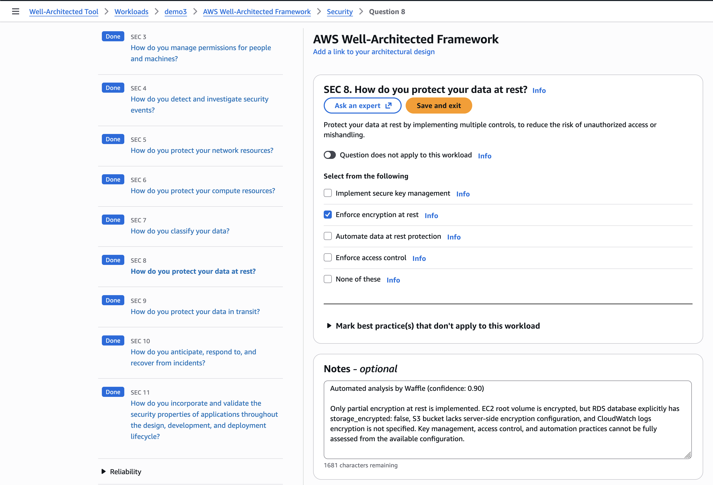

# Waffle - Well Architected Framework for Less Effort
Waffle is a CLI utility that automates AWS Well-Architected Framework Reviews by analyzing Terraform infrastructure using Amazon Bedrock foundation models via direct API invocation in AWS. The Well-Architected Framework questions are then being analyzed by Amazon Bedrock and answered and posted directly to the Well-Architected tool in AWS.

By default, Waffle analyzes your Terraform configuration files (.tf) and modules. Alternatively, you can analyze Terraform plan files for potentially greater context with computed values and dependencies.

This project was born at the AWS Oslo GenAI Hackathon 2025 as part of the Business Innovation track — designed and built by humans, empowered by Kiro.

## High Level Design
 


## Example output



## Key Features

- **HCL File Analysis**: Analyzes Terraform .tf files and modules by default
- **JSON File Analysis**: Alternative mode using Terraform JSON files (plan or state) for computed values
- **Reduced Sensitive Data**: HCL file analysis minimizes exposure of sensitive values
- **No Infrastructure Required**: Direct Bedrock API invocation - no Lambda or agents to deploy
- **Portable**: Works anywhere AWS credentials work
- **Comprehensive**: Supports all WAFR pillars and custom lenses

## Project Structure

```
waffle/
├── cmd/
│   └── waffle/           # CLI entry point
│       └── main.go
├── internal/             # Private application code
│   ├── core/            # Core engine and types
│   │   ├── types.go     # Core data types
│   │   ├── errors.go    # Error definitions
│   │   ├── interfaces.go # Component interfaces
│   │   ├── engine.go    # Core orchestration engine
│   │   ├── types_test.go
│   │   └── properties_test.go
│   ├── iac/             # IaC analyzer
│   │   └── analyzer.go
│   ├── session/         # Session manager
│   │   └── manager.go
│   ├── wafr/            # WAFR evaluator
│   │   └── evaluator.go
│   ├── bedrock/         # Bedrock client
│   │   └── client.go
│   └── report/          # Report generator
│       └── generator.go
├── test/                # Additional test data and helpers
│   ├── fixtures/        # Test IaC files
│   └── mocks/           # Mock implementations
├── go.mod
├── go.sum
└── README.md
```

## Dependencies

- **Go 1.21+**
- **AWS SDK for Go v2**
  - `github.com/aws/aws-sdk-go-v2` - Core SDK
  - `github.com/aws/aws-sdk-go-v2/service/wellarchitected` - WAFR API client
  - `github.com/aws/aws-sdk-go-v2/service/bedrockruntime` - Bedrock Runtime API client
- **CLI Framework**
  - `github.com/spf13/cobra` - Command-line interface
  - `github.com/spf13/viper` - Configuration management
- **Testing**
  - `github.com/leanovate/gopter` - Property-based testing
  - `github.com/stretchr/testify` - Test assertions
- **Utilities**
  - `golang.org/x/sync/errgroup` - Concurrent error handling
  - `golang.org/x/time/rate` - Rate limiting

## Installation
### Build and install from Source

```bash
git clone https://github.com/partly-notes/waffle.git
cd waffle
make install        # Install to /usr/local/bin (requires sudo)
# OR
make install-user   # Install to $GOPATH/bin (no sudo required)
```

### Using Go Install

If you have Go 1.21+ installed:

```bash
go install github.com/partly-notes/waffle/cmd/waffle@latest
```

This installs the binary to `$GOPATH/bin` (or `~/go/bin` by default). Make sure this directory is in your PATH:

```bash
# Add to ~/.bashrc or ~/.zshrc if needed
export PATH=$PATH:$(go env GOPATH)/bin
```

### Using Docker

```bash
docker pull ghcr.io/partly-notes/waffle:latest

# Run with AWS credentials
docker run --rm -it \
  -v ~/.aws:/root/.aws:ro \
  -v $(pwd):/workspace \
  -w /workspace \
  ghcr.io/partly-notes/waffle:latest \
  review --workload-id my-app
```


## Building

### Quick Build

```bash
make build          # Build for current platform
make test           # Run tests
make docker-build   # Build Docker image
```

Run `make help` to see all available targets.

## Usage

### Configuration

Waffle can be configured through:
1. Configuration file at `~/.waffle/config.yaml`
2. Environment variables (prefixed with `WAFFLE_`)
3. Command-line flags (highest precedence)

See `config.example.yaml` for a complete configuration example.

### Global Flags

All commands support these global flags:

- `--region`: AWS region for Bedrock and WAFR (overrides config and environment)
- `--profile`: AWS profile to use (overrides config and environment)
- `--quiet, -q`: Quiet mode - only show errors
- `--verbose, -v`: Verbose mode - show debug information
- `--log-level`: Set log level (DEBUG, INFO, WARNING, ERROR)

### Commands

#### Initialize and Validate Setup

```bash
# Validate with default configuration
waffle init

# Validate with specific region
waffle init --region us-west-2

# Validate with specific profile and region
waffle init --profile my-profile --region eu-west-1
```

#### Run a WAFR Review

```bash
# Review using Terraform configuration files (default)
waffle review --workload-id my-app

# Review using Terraform plan JSON (alternative)
terraform plan -out=plan.tfplan && terraform show -json plan.tfplan > plan.json
waffle review --workload-id my-app --plan-file plan.json

# Review using current state JSON (alternative)
terraform show -json > state.json
waffle review --workload-id my-app --plan-file state.json

# Review with quiet output (errors only)
waffle review --workload-id my-app --quiet

# Review with specific AWS region
waffle review --workload-id my-app --region us-west-2

# Review specific pillar
waffle review --workload-id my-app --scope pillar --pillar security

# Review specific question
waffle review --workload-id my-app --scope question --question-id sec_data_1
```

**Analysis Modes:**
- **Default**: Analyzes Terraform configuration files (.tf) and modules after `terraform init`
- **Alternative**: Uses Terraform JSON files (`--plan-file`) for computed values and dependencies
  - Plan JSON: `terraform plan -out=plan.tfplan && terraform show -json plan.tfplan > plan.json`
  - State JSON: `terraform show -json > state.json`
- **Note**: Only one mode is used per review - configuration files OR JSON file, not both
- **Benefits**: HCL file analysis requires less sensitive data exposure while still providing comprehensive WAFR analysis

#### Check Review Status

```bash
waffle status <session-id>
```

#### Get Review Results

```bash
# Get results as JSON to stdout
waffle results <session-id>

# Get results as JSON to file
waffle results <session-id> --format json --output results.json

# Get results as PDF
waffle results <session-id> --format pdf --output report.pdf
```

## Contributing

We welcome contributions to Waffle! Whether you're fixing bugs, adding features, improving documentation, or suggesting enhancements, your contributions help make this project better for everyone.

### How to Contribute

1. **Fork the repository** and create a feature branch from `main`
2. **Make your changes** following the coding standards below
3. **Add or update tests** for your changes
4. **Ensure all tests pass** and the code builds successfully
5. **Submit a pull request** with a clear description of your changes

### Code of Conduct

Please be respectful and constructive in all interactions. We're committed to providing a welcoming and inclusive environment for all contributors.

### Reporting Issues

- Use the GitHub issue tracker to report bugs or request features
- Include clear steps to reproduce any bugs
- Provide as much context as possible (OS, Go version, etc.)

### Prerequisites

- Go 1.21 or later
- AWS credentials configured
- Make (optional but recommended)

### Development Workflow

```bash
# Clone the repository
git clone https://github.com/partly-notes/waffle.git
cd waffle

# Install dependencies
go mod download

# Run tests
make test

# Build
make build

# Run locally
./build/waffle --version
```

### Running Tests

```bash
make test                # All tests
make test-coverage       # With coverage report
make test-property       # Property-based tests only
```

### Code Quality

```bash
make fmt                 # Format code
make vet                 # Run go vet
make lint                # Run golangci-lint
```


## License

MIT License

Copyright (c) 2025 partly-notes

Permission is hereby granted, free of charge, to any person obtaining a copy
of this software and associated documentation files (the "Software"), to deal
in the Software without restriction, including without limitation the rights
to use, copy, modify, merge, publish, distribute, sublicense, and/or sell
copies of the Software, and to permit persons to whom the Software is
furnished to do so, subject to the following conditions:

The above copyright notice and this permission notice shall be included in all
copies or substantial portions of the Software.

THE SOFTWARE IS PROVIDED "AS IS", WITHOUT WARRANTY OF ANY KIND, EXPRESS OR
IMPLIED, INCLUDING BUT NOT LIMITED TO THE WARRANTIES OF MERCHANTABILITY,
FITNESS FOR A PARTICULAR PURPOSE AND NONINFRINGEMENT. IN NO EVENT SHALL THE
AUTHORS OR COPYRIGHT HOLDERS BE LIABLE FOR ANY CLAIM, DAMAGES OR OTHER
LIABILITY, WHETHER IN AN ACTION OF CONTRACT, TORT OR OTHERWISE, ARISING FROM,
OUT OF OR IN CONNECTION WITH THE SOFTWARE OR THE USE OR OTHER DEALINGS IN THE
SOFTWARE.
